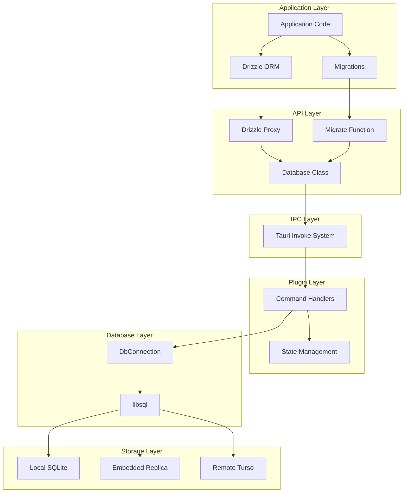
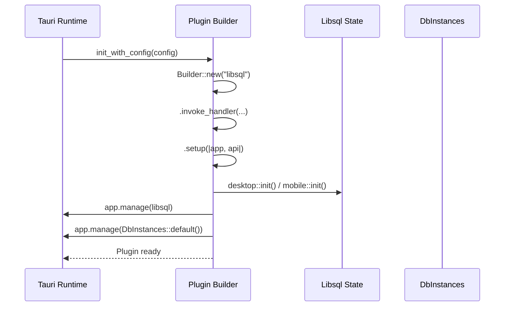
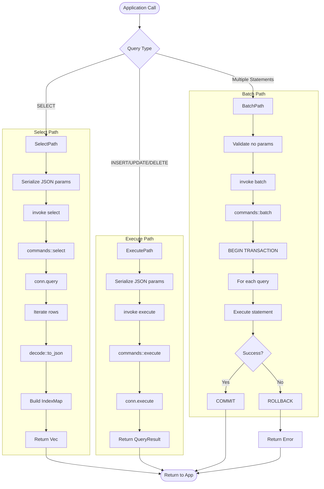
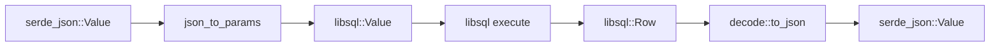
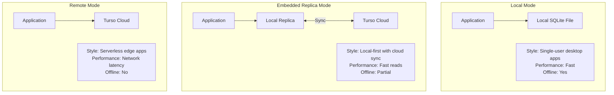
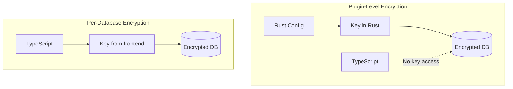

# Architecture

<cite>
**Referenced Files in This Document**
- [src/lib.rs](file://src/lib.rs)
- [src/commands.rs](file://src/commands.rs)
- [src/wrapper.rs](file://src/wrapper.rs)
- [src/desktop.rs](file://src/desktop.rs)
- [guest-js/index.ts](file://guest-js/index.ts)
- [guest-js/drizzle.ts](file://guest-js/drizzle.ts)
- [SKILL.md](file://SKILL.md)
</cite>

## Table of Contents

1. [High-Level Architecture](#high-level-architecture)
2. [Plugin Architecture](#plugin-architecture)
3. [Data Flow Architecture](#data-flow-architecture)
4. [Connection Modes](#connection-modes)
5. [Security Architecture](#security-architecture)

## High-Level Architecture



The architecture follows a clean separation of concerns across five distinct layers:

1. **Application Layer**: End-user code using Drizzle ORM or raw queries
2. **API Layer**: TypeScript API providing the `Database` class and helper functions
3. **IPC Layer**: Tauri's invoke system for secure frontend-backend communication
4. **Plugin Layer**: Rust command handlers and state management
5. **Database Layer**: Connection management and libsql integration
6. **Storage Layer**: Actual data storage (local files, replicas, or remote)

**Diagram sources**

- [src/lib.rs](file://src/lib.rs)
- [src/commands.rs](file://src/commands.rs)
- [guest-js/index.ts](file://guest-js/index.ts)

**Section sources**

- [SKILL.md](file://SKILL.md#L244-L264)

## Plugin Architecture

The Tauri plugin follows the standard Tauri v2 plugin architecture with clear separation between initialization, command handling, and state management.

### Plugin Initialization



The plugin initialization process:

1. **Builder Configuration**: Creates a Tauri plugin builder with the plugin name "libsql"
2. **Command Registration**: Registers all command handlers via `generate_handler!` macro
3. **State Setup**: Initializes two state objects managed by Tauri:
   - `Libsql`: Plugin configuration (base_path, encryption defaults)
   - `DbInstances`: Connection pool for active database connections
4. **Platform Abstraction**: Uses conditional compilation for desktop vs mobile

**Section sources**

- [src/lib.rs](file://src/lib.rs#L24-L54)
- [src/desktop.rs](file://src/desktop.rs#L17-L23)

### State Management

The plugin maintains two primary state containers:

```rust
// Plugin-level configuration
pub struct Libsql(pub Config);

// Database connection pool
pub struct DbInstances(
    pub Arc<Mutex<HashMap<String, Arc<DbConnection>>>>
);
```

**Libsql State** (managed at plugin level):
- `base_path`: Root directory for relative database paths
- `encryption`: Default encryption configuration
- Platform-specific initialization (desktop vs mobile)

**DbInstances State** (managed per-app):
- Thread-safe HashMap of path -> connection
- Uses `Arc<Mutex<...>>` for shared ownership
- `Arc<DbConnection>` enables multiple references to same connection

**Section sources**

- [src/wrapper.rs](file://src/wrapper.rs#L289-L296)
- [src/desktop.rs](file://src/desktop.rs#L8-L15)

### Command Handler Pattern

All Tauri commands follow a consistent pattern:

```rust
#[command]
pub(crate) async fn command_name<R: Runtime>(
    app: AppHandle<R>,           // Access to app state
    db_instances: State<'_, DbInstances>,  // Connection pool
    payload: RequestType,        // Typed request data
) -> Result<ResponseType, Error> {
    // Lock discipline: clone Arc while holding lock
    let conn = {
        let instances = db_instances.0.lock().await;
        instances.get(&db).ok_or(...)?.clone()
    };
    
    // Release lock before await
    conn.operation().await
}
```

**Key aspects**:
- Generic over `Runtime` for cross-platform support
- Extracts state using Tauri's `State` extractor
- Proper mutex lock discipline (clone Arc, release lock, then await)
- Consistent error handling via `Result<T, Error>`

**Section sources**

- [src/commands.rs](file://src/commands.rs#L14-L71)

## Data Flow Architecture

### Query Flow



### Value Conversion Pipeline



The plugin handles complex value conversion between JavaScript/JSON and SQLite types:

**JavaScript → SQLite** (`json_to_libsql_value`):
- `null` → `Value::Null`
- `boolean` → `Value::Integer(0/1)`
- `number` → `Value::Integer` or `Value::Real`
- `string` → `Value::Text`
- `number[]` (all numbers) → `Value::Blob` (byte array)
- `array/object` → `Value::Text` (JSON stringified)

**SQLite → JavaScript** (`value_to_json`):
- `Value::Null` → `JsonValue::Null`
- `Value::Integer` → `JsonValue::Number`
- `Value::Real` → `JsonValue::Number` (with float validation)
- `Value::Text` → `JsonValue::String`
- `Value::Blob` → `JsonValue::Array` of numbers

**Section sources**

- [src/wrapper.rs](file://src/wrapper.rs#L250-L287)
- [src/decode.rs](file://src/decode.rs)

## Connection Modes

The plugin supports three distinct connection modes, each optimized for different use cases:



### Local Mode

Direct SQLite file access with no network dependencies.

```rust
// Connection string: "sqlite:app.db"
DbConnection::connect(
    "sqlite:app.db",
    encryption,      // Optional
    base_path,       // Directory for relative paths
    None,           // No sync_url
    None,           // No auth_token
).await
```

**Use cases**: Desktop apps, offline tools, local development

### Embedded Replica Mode

Local SQLite file that syncs with Turso cloud database.

```rust
// Connection string: "sqlite:local.db"
DbConnection::connect(
    "sqlite:local.db",
    encryption,
    base_path,
    Some("libsql://mydb.turso.io"),  // sync_url
    Some("auth-token"),              // auth_token
).await
```

**Key behaviors**:
- Initial sync pulls latest data on connect
- Reads happen locally (fast)
- Writes sync to remote
- Manual `db.sync()` for incremental updates

**Use cases**: Multi-device apps, backup/sync requirements, local-first architecture

### Remote Mode

Direct connection to Turso cloud (no local file).

```rust
// Connection string: "libsql://mydb.turso.io"
DbConnection::connect(
    "libsql://mydb.turso.io",
    None,           // No encryption for remote
    base_path,
    None,           // No sync_url
    Some("auth-token"),
).await
```

**Use cases**: Serverless applications, edge functions

**Section sources**

- [src/wrapper.rs](file://src/wrapper.rs#L33-L166)
- [README.md](file://README.md#L250-L320)

## Security Architecture

### Path Traversal Prevention

The plugin implements strict path validation to prevent directory traversal attacks:

```rust
fn resolve_local_path(path: &str, base_path: &Path) -> Result<PathBuf, Error> {
    // 1. Strip sqlite: prefix
    let db_path = path.strip_prefix("sqlite:").unwrap_or(path);
    
    // 2. Handle :memory: special case
    if db_path == ":memory:" { ... }
    
    // 3. Normalize path components
    let normalised = joined.components().fold(PathBuf::new(), |mut acc, c| {
        match c {
            Component::ParentDir => { acc.pop(); }
            Component::CurDir => {}
            _ => acc.push(c),
        }
        acc
    });
    
    // 4. Verify path stays within base_path
    if !normalised.starts_with(base_path) {
        return Err(Error::InvalidDbUrl("path escapes base directory".into()));
    }
    
    Ok(normalised)
}
```

**Security guarantees**:
- Paths containing `..` are normalized
- Relative paths are resolved against configured `base_path`
- Paths that escape `base_path` are rejected with error
- Prevents `sqlite:../../../etc/passwd` style attacks

**Section sources**

- [src/wrapper.rs](file://src/wrapper.rs#L64-L96)

### Encryption Architecture



**Plugin-level (recommended)**:
- Encryption key configured in Rust, never exposed to JavaScript
- Most secure option for production applications
- Key managed via environment variables or secure storage

**Per-database**:
- Key passed from TypeScript during `Database.load()`
- Useful for user-provided keys (e.g., password manager)
- Key travels through IPC (less secure)

### Panic Safety

The libsql library calls `unwrap()` internally on malformed URLs, which would crash the Tauri process. The plugin wraps all libsql builder calls in `catch_unwind`:

```rust
let db = AssertUnwindSafe(async move {
    // libsql builder calls that might panic
})
.catch_unwind()
.await
.map_err(|_| Error::InvalidDbUrl("libsql panicked...".into()))?;
```

This converts panics into proper error responses that can be handled gracefully by the frontend.

**Section sources**

- [src/wrapper.rs](file://src/wrapper.rs#L33-L60)
- [README.md](file://README.md#L180-L210)
