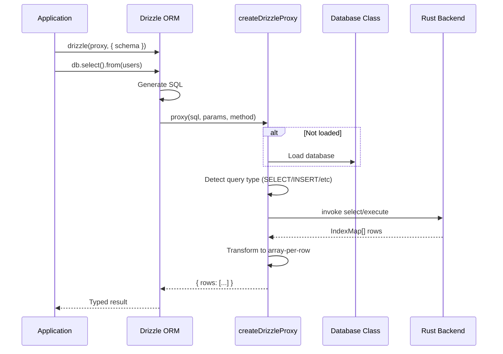

# Frontend Application

<cite>
**Referenced Files in This Document**
- [guest-js/index.ts](file://guest-js/index.ts)
- [guest-js/drizzle.ts](file://guest-js/drizzle.ts)
- [guest-js/migrate.ts](file://guest-js/migrate.ts)
- [package.json](file://package.json)
- [tsconfig.json](file://tsconfig.json)
- [rollup.config.js](file://rollup.config.js)
</cite>

## Table of Contents

1. [Package Structure](#package-structure)
2. [Database Class](#database-class)
3. [Drizzle ORM Integration](#drizzle-orm-integration)
4. [Migration System](#migration-system)
5. [Build System](#build-system)

## Package Structure

The TypeScript frontend is published as `tauri-plugin-libsql-api` on npm.

```
guest-js/
├── index.ts       # Database class, getConfig, main exports
├── drizzle.ts     # Drizzle ORM proxy implementation
├── migrate.ts     # Browser-safe migration runner
└── (dist-js/)     # Compiled output (not in source)
```

### Package Configuration

```json
{
  "name": "tauri-plugin-libsql-api",
  "version": "0.1.0",
  "type": "module",
  "types": "./dist-js/index.d.ts",
  "main": "./dist-js/index.cjs",
  "module": "./dist-js/index.js",
  "exports": {
    ".": {
      "types": "./dist-js/index.d.ts",
      "import": "./dist-js/index.js",
      "require": "./dist-js/index.cjs"
    }
  }
}
```

The package provides:
- **ESM and CJS builds**: Dual format support via Rollup
- **TypeScript declarations**: Full type safety
- **Tree-shakeable exports**: Individual function imports

**Section sources**

- [package.json](file://package.json)

### Entry Points

Main exports from `guest-js/index.ts`:

```typescript
// Core classes and functions
export { Database, getConfig } from "./index";
export type { 
  LoadOptions, 
  QueryResult, 
  ConfigInfo,
  EncryptionConfig,
  Cipher 
} from "./index";

// Drizzle integration
export { createDrizzleProxy, createDrizzleProxyWithEncryption } from "./drizzle";
export type { SqliteProxyCallback } from "./drizzle";

// Migration system
export { migrate } from "./migrate";
export type { MigrationFiles, MigrateOptions } from "./migrate";
```

**Section sources**

- [guest-js/index.ts](file://guest-js/index.ts#L228-L233)

## Database Class

The `Database` class is the primary interface for database operations from TypeScript.

### Class Structure

```typescript
export class Database {
  path: string;
  
  constructor(path: string) {
    this.path = path;
  }
  
  static async load(pathOrOptions: string | LoadOptions): Promise<Database>
  async execute(query: string, bindValues?: unknown[]): Promise<QueryResult>
  async select<T>(query: string, bindValues?: unknown[]): Promise<T>
  async batch(queries: string[]): Promise<void>
  async sync(): Promise<void>
  async close(db?: string): Promise<boolean>
}
```

**Section sources**

- [guest-js/index.ts](file://guest-js/index.ts#L54-L211)

### Static Load Method

```typescript
static async load(pathOrOptions: string | LoadOptions): Promise<Database> {
  const options =
    typeof pathOrOptions === "string"
      ? { path: pathOrOptions }
      : pathOrOptions;

  const _path = await invoke<string>("plugin:libsql|load", { options });
  return new Database(_path);
}
```

The `load` method:
1. Accepts either a string path or `LoadOptions` object
2. Normalizes to options format
3. Invokes the Rust `load` command
4. Returns a new `Database` instance with the resolved path

**LoadOptions interface**:

```typescript
export interface LoadOptions {
  path: string;                    // "sqlite:app.db" or "libsql://..."
  encryption?: EncryptionConfig;   // Optional encryption
  syncUrl?: string;               // For embedded replica
  authToken?: string;             // For Turso connections
}

export interface EncryptionConfig {
  cipher: Cipher;                 // Currently only "aes256cbc"
  key: number[] | Uint8Array;     // Exactly 32 bytes
}
```

**Section sources**

- [guest-js/index.ts](file://guest-js/index.ts#L15-L38)
- [guest-js/index.ts](file://guest-js/index.ts#L87-L95)

### Query Methods

#### Execute

```typescript
async execute(
  query: string, 
  bindValues?: unknown[]
): Promise<QueryResult> {
  const result = await invoke<QueryResult>("plugin:libsql|execute", {
    db: this.path,
    query,
    values: bindValues ?? [],
  });
  return result;
}
```

**Usage**:

```typescript
const result = await db.execute(
  "INSERT INTO users (name, email) VALUES ($1, $2)",
  ["Alice", "alice@example.com"]
);
console.log(result.rowsAffected);  // 1
console.log(result.lastInsertId);  // Auto-generated ID
```

**Section sources**

- [guest-js/index.ts](file://guest-js/index.ts#L116-L123)

#### Select

```typescript
async select<T>(
  query: string, 
  bindValues?: unknown[]
): Promise<T> {
  const result = await invoke<T>("plugin:libsql|select", {
    db: this.path,
    query,
    values: bindValues ?? [],
  });
  return result;
}
```

**Usage**:

```typescript
const users = await db.select<Array<{ id: number; name: string }>>(
  "SELECT * FROM users WHERE active = $1",
  [true]
);
```

**Section sources**

- [guest-js/index.ts](file://guest-js/index.ts#L138-L145)

#### Batch

```typescript
async batch(queries: string[]): Promise<void> {
  await invoke("plugin:libsql|batch", { db: this.path, queries });
}
```

**Important**: Queries in a batch cannot use bound parameters. Use for DDL or bulk operations:

```typescript
await db.batch([
  "CREATE TABLE users (id INTEGER PRIMARY KEY, name TEXT)",
  "CREATE INDEX idx_name ON users(name)",
  "INSERT INTO users (name) VALUES ('Admin')",
]);
```

**Section sources**

- [guest-js/index.ts](file://guest-js/index.ts#L178-L180)

### Sync Method

```typescript
async sync(): Promise<void> {
  await invoke("plugin:libsql|sync", { db: this.path });
}
```

Pulls latest changes from Turso remote for embedded replica mode. No-op for local databases.

**Section sources**

- [guest-js/index.ts](file://guest-js/index.ts#L203-L205)

### Close Method

```typescript
async close(db?: string): Promise<boolean> {
  const success = await invoke<boolean>("plugin:libsql|close", { db });
  return success;
}
```

Closes either a specific database (if `db` provided) or all connections (if omitted).

**Section sources**

- [guest-js/index.ts](file://guest-js/index.ts#L207-L210)

## Drizzle ORM Integration

The plugin provides first-class Drizzle ORM support via the sqlite-proxy pattern.

### The Proxy Pattern



**Section sources**

- [guest-js/drizzle.ts](file://guest-js/drizzle.ts)

### createDrizzleProxy

```typescript
export function createDrizzleProxy(dbPath: string): SqliteProxyCallback {
  return createProxy({ path: dbPath });
}

function createProxy(options: LoadOptions): SqliteProxyCallback {
  let loaded = false;

  return async (sql, params, method) => {
    // Lazy load on first query
    if (!loaded) {
      await invoke<string>("plugin:libsql|load", { options });
      loaded = true;
    }

    // Detect if SELECT query
    const isSelect = /^\s*(\/\*[\s\S]*?\*\/\s*|--[^\n]*\n\s*)*SELECT\b/i.test(sql);

    if (isSelect || method === "all" || method === "get" || method === "values") {
      const rows = await invoke<Record<string, unknown>[]>(
        "plugin:libsql|select", 
        { db: options.path, query: sql, values: params }
      );
      
      // Transform IndexMap rows to array-per-row format
      const transformedRows = rows.map((row) => Object.values(row));
      
      return { rows: transformedRows };
    }

    // INSERT / UPDATE / DELETE
    await invoke("plugin:libsql|execute", {
      db: options.path,
      query: sql,
      values: params,
    });
    return { rows: [] };
  };
}
```

**Key behaviors**:
- **Lazy loading**: Database is loaded on first query, not at proxy creation
- **Query detection**: Uses regex to detect SELECT statements
- **Row transformation**: Converts `IndexMap` (object) to array format Drizzle expects
- **Method support**: Handles 'all', 'run', 'get', 'values' methods

**Section sources**

- [guest-js/drizzle.ts](file://guest-js/drizzle.ts#L29-L66)

### Usage Example

```typescript
import { drizzle } from "drizzle-orm/sqlite-proxy";
import { createDrizzleProxy } from "tauri-plugin-libsql-api";
import * as schema from "./schema";

// Create proxy
const proxy = createDrizzleProxy("sqlite:app.db");

// Initialize Drizzle
const db = drizzle(proxy, { schema });

// Use with full type safety
const users = await db.select().from(schema.users);
await db.insert(schema.users).values({ name: "Alice" });
```

### Encrypted Drizzle Proxy

For encrypted databases:

```typescript
const proxy = createDrizzleProxyWithEncryption({
  path: "sqlite:encrypted.db",
  encryption: {
    cipher: "aes256cbc",
    key: my32ByteKey,
  },
});

const db = drizzle(proxy, { schema });
```

**Section sources**

- [guest-js/drizzle.ts](file://guest-js/drizzle.ts#L84-L103)

## Migration System

The plugin includes a custom migration system designed for browser/WebView environments where filesystem access is unavailable.

### The Problem

Standard Drizzle migrations use `drizzle-orm/sqlite-proxy/migrator` which calls:

```typescript
// This does NOT work in Tauri WebView!
import { readMigrationFiles } from "drizzle-orm/sqlite-proxy/migrator";
const migrations = readMigrationFiles("./drizzle"); // Uses Node.js fs
```

The `readMigrationFiles` function uses Node.js filesystem APIs that don't exist in a browser context.

### The Solution: Vite Import Glob

```typescript
// Bundle SQL files at BUILD TIME
const migrations = import.meta.glob<string>("./drizzle/*.sql", {
  eager: true,
  query: "?raw",
  import: "default",
});
```

This Vite feature:
- Resolves glob patterns at **build time**, not runtime
- Bundles file contents directly into the JavaScript bundle
- No filesystem access required at runtime

**Section sources**

- [guest-js/migrate.ts](file://guest-js/migrate.ts#L1-L16)
- [SKILL.md](file://SKILL.md#L36-L52)

### Migration File Format

Migration files follow Drizzle's naming convention:

```
drizzle/
├── 0000_initial.sql
├── 0001_add_users.sql
├── 0002_add_index.sql
└── ...
```

The migration parser extracts the numeric prefix for ordering:

```typescript
const match = path.match(/(\d+)[_\-].*\.sql$/);
const index = parseInt(match[1], 10);
```

**Section sources**

- [guest-js/migrate.ts](file://guest-js/migrate.ts#L32-L48)

### Migration Algorithm

```typescript
export async function migrate(
  dbPath: string,
  migrationFiles: MigrationFiles,
  options: MigrateOptions = {},
): Promise<void> {
  const table = options.migrationsTable ?? "__drizzle_migrations";

  // 1. Create migrations tracking table
  await invoke("plugin:libsql|execute", {
    db: dbPath,
    query: `CREATE TABLE IF NOT EXISTS ${table} (...)`,
    values: [],
  });

  // 2. Get already applied migrations
  const applied = await invoke<Array<{ hash: string }>>(
    "plugin:libsql|select",
    { db: dbPath, query: `SELECT hash FROM ${table}`, values: [] }
  );
  const appliedSet = new Set(applied.map((r) => r.hash));

  // 3. Parse and sort migrations
  const migrations = parseMigrations(migrationFiles);

  // 4. Apply pending migrations
  for (const migration of migrations) {
    if (appliedSet.has(migration.filename)) {
      continue; // Skip already applied
    }

    // Split SQL into statements
    const statements = migration.sql
      .split(";")
      .map((s) => s.trim())
      .filter((s) => s.length > 0);

    // Add migration record
    const safeName = migration.filename.replace(/'/g, "''");
    statements.push(`INSERT INTO ${table} (hash) VALUES ('${safeName}')`);

    // Execute in transaction
    await invoke("plugin:libsql|batch", {
      db: dbPath,
      queries: statements,
    });
  }
}
```

**Key features**:
- **Idempotent**: Safe to call multiple times
- **Transactional**: Each migration runs in a batch (transaction)
- **Tracking**: Applied migrations recorded in `__drizzle_migrations`
- **Ordering**: Numeric prefix determines order

**Section sources**

- [guest-js/migrate.ts](file://guest-js/migrate.ts#L79-L131)

### Usage Pattern

```typescript
import { Database, migrate, createDrizzleProxy } from "tauri-plugin-libsql-api";
import { drizzle } from "drizzle-orm/sqlite-proxy";
import * as schema from "./schema";

// 1. Bundle migrations
const migrations = import.meta.glob<string>("../drizzle/*.sql", {
  eager: true,
  query: "?raw",
  import: "default",
});

const dbPath = "sqlite:app.db";

// 2. Load database
await Database.load(dbPath);

// 3. Run migrations BEFORE any queries
await migrate(dbPath, migrations);

// 4. Now safe to use Drizzle
const db = drizzle(createDrizzleProxy(dbPath), { schema });
```

**Critical**: Always call `migrate()` after `Database.load()` and before any table queries.

**Section sources**

- [SKILL.md](file://SKILL.md#L40-L52)

## Build System

The TypeScript code is built using Rollup with TypeScript plugin.

### Rollup Configuration

```javascript
import typescript from "@rollup/plugin-typescript";

export default {
  input: "guest-js/index.ts",
  output: [
    { file: exports.import, format: "esm" },    // ES modules
    { file: exports.require, format: "cjs" },   // CommonJS
  ],
  plugins: [
    typescript({
      declaration: true,
      declarationDir: dirname(exports.import),
    }),
  ],
  external: [
    /^@tauri-apps\/api/,
    ...Object.keys(pkg.dependencies || {}),
  ],
};
```

**Build outputs**:
- `dist-js/index.js` - ESM build
- `dist-js/index.cjs` - CommonJS build
- `dist-js/index.d.ts` - TypeScript declarations

**Section sources**

- [rollup.config.js](file://rollup.config.js)

### Build Commands

```bash
# Build JavaScript package
npm run build
# or
pnpm build
# or
rollup -c
```

### Development Workflow

When developing the plugin:

1. Modify files in `guest-js/`
2. Run `npm run build` to compile
3. The example app (if using `file:../../`) picks up changes automatically

**Section sources**

- [package.json](file://package.json#L26-L28)
