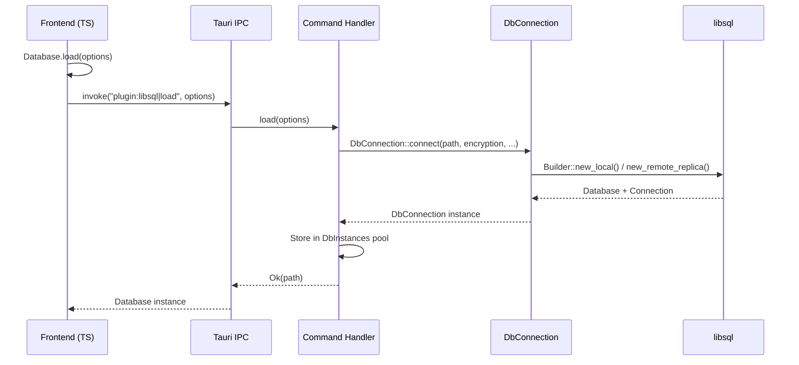
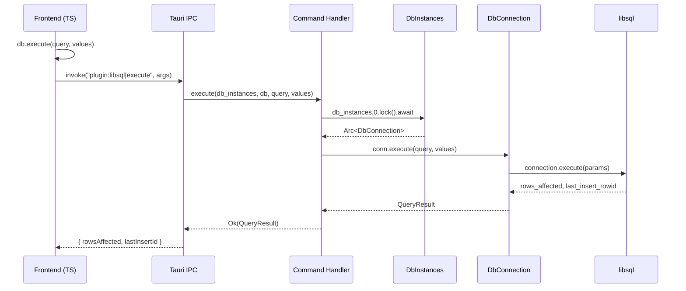
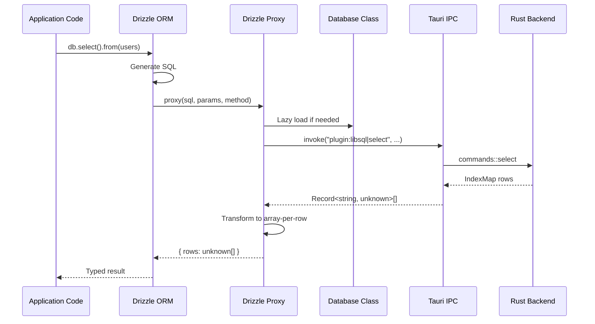

# System Overview

<cite>
**Referenced Files in This Document**
- [Cargo.toml](file://Cargo.toml)
- [package.json](file://package.json)
- [README.md](file://README.md)
- [SKILL.md](file://SKILL.md)
- [src/lib.rs](file://src/lib.rs)
- [guest-js/index.ts](file://guest-js/index.ts)
</cite>

## Table of Contents

1. [Introduction](#introduction)
2. [Key Features](#key-features)
3. [Architecture Overview](#architecture-overview)
4. [Project Structure](#project-structure)
5. [Communication Flow](#communication-flow)
6. [Use Cases](#use-cases)

## Introduction

tauri-plugin-libsql is a Tauri plugin that provides SQLite database access through libsql (Turso's fork of SQLite). It enables Tauri applications to use SQLite databases with full Drizzle ORM integration, AES-256-CBC encryption support, and browser-safe migrations—all without requiring a Node.js runtime.

The plugin solves a critical problem for Tauri apps: traditional Drizzle ORM requires filesystem access at runtime to read migration files, which is impossible inside a WebView browser context. This plugin works around this limitation by accepting pre-bundled SQL content from Vite's `import.meta.glob`, enabling type-safe database operations in pure Tauri applications.

**Section sources**

- [README.md](file://README.md#L1-L50)
- [SKILL.md](file://SKILL.md#L18-L52)

## Key Features

### 1. Full SQLite Compatibility
The plugin uses libsql as its underlying database engine, providing complete SQLite compatibility with additional enhancements from the Turso ecosystem.

### 2. Native AES-256-CBC Encryption
Built-in encryption support via libsql's native encryption capabilities. Encryption keys can be configured at the plugin level (recommended for security) or per-database from the frontend.

### 3. Drizzle ORM Integration
Full support for Drizzle ORM through the sqlite-proxy pattern. Drizzle generates SQL queries in TypeScript, which are then executed through Tauri's invoke system to the Rust backend.

### 4. Browser-Safe Migration Runner
Custom migration system that accepts pre-bundled SQL files rather than reading from the filesystem at runtime. Migrations are bundled at build time using Vite's `import.meta.glob`.

### 5. Turso Embedded Replica Support
Optional replication feature enables local-first apps that sync with Turso cloud databases. Local reads are instant while writes propagate to the remote.

### 6. Cross-Platform Support
Works on macOS, Windows, Linux, iOS, and Android (mobile implementation currently stubs).

**Section sources**

- [README.md](file://README.md#L43-L90)
- [Cargo.toml](file://Cargo.toml#L26-L31)

## Architecture Overview

```mermaid
graph TB
    subgraph "Frontend (TypeScript)"
        A[Database Class] --> B[Drizzle ORM]
        A --> C[Migration Runner]
        B --> D[Drizzle Proxy]
    end

    subgraph "Tauri IPC"
        E[invoke\|load]
        F[invoke\|execute]
        G[invoke\|select]
        H[invoke\|batch]
        I[invoke\|sync]
    end

    subgraph "Backend (Rust)"
        J[Command Handlers]
        K[DbConnection]
        L[libsql Client]
    end

    subgraph "Storage"
        M[Local SQLite]
        N[Turso Cloud]
    end

    A --> E
    A --> F
    A --> G
    A --> H
    A --> I
    D --> F
    D --> G
    E --> J
    F --> J
    G --> J
    H --> J
    I --> J
    J --> K
    K --> L
    L --> M
    L --> N
```

The architecture follows a layered design:

1. **Frontend Layer**: TypeScript API providing a `Database` class and Drizzle integration
2. **IPC Layer**: Tauri's invoke system for communication between frontend and backend
3. **Backend Layer**: Rust plugin handling commands and managing libsql connections
4. **Storage Layer**: SQLite databases (local, embedded replica, or pure remote)

**Diagram sources**

- [src/lib.rs](file://src/lib.rs)
- [src/commands.rs](file://src/commands.rs)
- [guest-js/index.ts](file://guest-js/index.ts)

**Section sources**

- [SKILL.md](file://SKILL.md#L244-L264)

## Project Structure

```
tauri-plugin-libsql/
├── src/                      # Rust plugin implementation
│   ├── lib.rs               # Plugin initialization and command registration
│   ├── commands.rs          # Tauri command handlers
│   ├── wrapper.rs           # DbConnection wrapper around libsql
│   ├── models.rs            # Serde types for IPC
│   ├── error.rs             # Error types with thiserror
│   ├── desktop.rs           # Desktop platform implementation
│   ├── mobile.rs            # Mobile platform stub
│   └── decode.rs            # Value conversion utilities
├── guest-js/                # TypeScript frontend API
│   ├── index.ts             # Database class and main exports
│   ├── drizzle.ts           # Drizzle ORM proxy implementation
│   └── migrate.ts           # Browser-safe migration runner
├── permissions/             # Tauri permission definitions
│   ├── default.toml         # Default permission set
│   ├── schemas/             # Permission schemas
│   └── autogenerated/       # Auto-generated permission files
├── examples/                # Demo applications
│   └── todo-list/           # Complete example with Drizzle + migrations
├── Cargo.toml              # Rust dependencies and features
├── package.json            # NPM package configuration
├── build.rs                # Tauri plugin build script
├── rollup.config.js        # JS build configuration
├── tsconfig.json           # TypeScript configuration
├── README.md               # User documentation
├── SKILL.md                # AI assistant skill reference
└── AGENTS.md               # Developer knowledge base
```

**Section sources**

- [README.md](file://README.md#L450-L470)
- [Cargo.toml](file://Cargo.toml)
- [package.json](file://package.json)

## Communication Flow

### Database Load Flow



### Query Execution Flow



### Drizzle Query Flow



**Diagram sources**

- [src/commands.rs](file://src/commands.rs#L15-L71)
- [src/wrapper.rs](file://src/wrapper.rs#L189-L226)
- [guest-js/drizzle.ts](file://guest-js/drizzle.ts#L29-L66)

**Section sources**

- [SKILL.md](file://SKILL.md#L244-L264)

## Use Cases

### Local-Only SQLite Applications
Perfect for desktop applications that need a local database without any cloud dependencies. The plugin provides full SQLite functionality with optional encryption.

**Example**: Note-taking apps, password managers, offline-first tools

### Turso-Backed Applications
Applications that need cloud sync capabilities can use the embedded replica feature. Data is stored locally for fast reads but syncs with Turso for backup and cross-device access.

**Example**: Todo apps, personal knowledge bases, bookmark managers

### Drizzle ORM in Tauri
Applications that want type-safe database operations without the complexity of managing raw SQL. Drizzle's excellent TypeScript integration provides autocomplete and type checking.

**Example**: Any application using structured data storage

### Encrypted Local Storage
Applications handling sensitive data can use AES-256-CBC encryption. The plugin supports both plugin-level encryption (keys never leave Rust) and per-database encryption.

**Example**: Password managers, secure note apps, encrypted file organizers

**Section sources**

- [README.md](file://README.md#L100-L200)
- [SKILL.md](file://SKILL.md#L117-L170)
